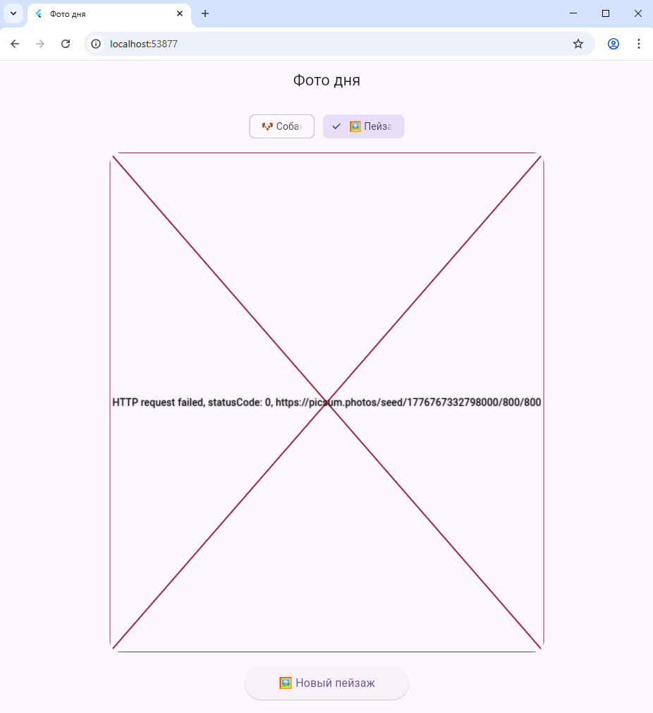

# Лабораторная работа №5. Асинхронность в Dart и Flutter. Приложение «Фото дня»

**Выполнил:** *[Тимонин И.В]*  
**Группа:** *[ИСП-233]*  
**Дата сдачи:** *[09.05.2026]*

---

## Описание проекта

Приложение «Фото дня» загружает случайные изображения (собак или пейзажей) с публичных API или из локальных ресурсов. Демонстрирует принципы асинхронного программирования в Dart — использование `Future`, `async/await`, обработку состояний загрузки и ошибок во Flutter.

---

## Стек и версии

- **Flutter:** 3.0+
- **Dart:** 3.0+
- **Платформа:** Web (Google Chrome)
- **Основной пакет:** `http` (для сетевых запросов)

---

## Скриншот приложения



---

## Запуск

1. Клонируйте репозиторий:
   ```bash
   git clone <url-вашего-репозитория>
## Инструкция по запуску

1. Убедитесь, что у вас установлен Flutter SDK (команда `flutter doctor` не показывает критических ошибок).
2. Клонируйте репозиторий:
   ```bash
   git clone <https://github.com/karasidnez/Flutter_lab5->
   cd Flutter_Lab5
   ```
3. Установите зависимости:
   ```bash
   flutter pub get
   ```
4. Запустите приложение в браузере Chrome
   ```bash
    flutter run -d chrome
   ```

## Что изучили

- Ключевые слова async и await для написания асинхронного кода в синхронном стиле.

- Обработку ошибок в асинхронных операциях с помощью try/catch.

- Использование пакета http для выполнения GET-запросов и парсинг JSON-ответов.

## Ответы на вопросы
**Что такое Future<T>? Чем отличается от обычного возвращаемого значения?**
Future<T> — это объект, который представляет отложенное вычисление. Он «обещает» вернуть значение типа T когда-нибудь в будущем. Обычная функция возвращает значение сразу, блокируя выполнение, а Future позволяет программе продолжать работу, пока операция не завершится.

**Что делает await? Блокирует ли он весь поток выполнения?**
await приостанавливает текущую асинхронную функцию до тех пор, пока Future не завершится. Он не блокирует весь поток выполнения — интерфейс остаётся отзывчивым, другие операции могут выполняться параллельно.

**Зачем setState() вызывается дважды в _fetchPhoto()?**
Первый вызов setState() устанавливает _isLoading = true, чтобы немедленно показать индикатор загрузки и сбросить предыдущие результаты. Второй вызов выполняется после получения данных, обновляя _imageUrl или _errorMessage и скрывая индикатор.

**Почему кнопке передаётся _fetchPhoto без скобок, а не _fetchPhoto()?**
Передаётся ссылка на функцию, а не результат её вызова. Если бы написали _fetchPhoto(), функция вызвалась бы прямо во время построения виджета, а не по нажатию кнопки. Без скобок мы сообщаем: «вызови эту функцию, когда кнопку нажмут».

**Чем Image.network() отличается от Image.asset()?**
Image.network() загружает изображение из сети по URL. Image.asset() отображает изображение, упакованное в ресурсы приложения. Первый требует подключения к интернету, второй работает офлайн.
